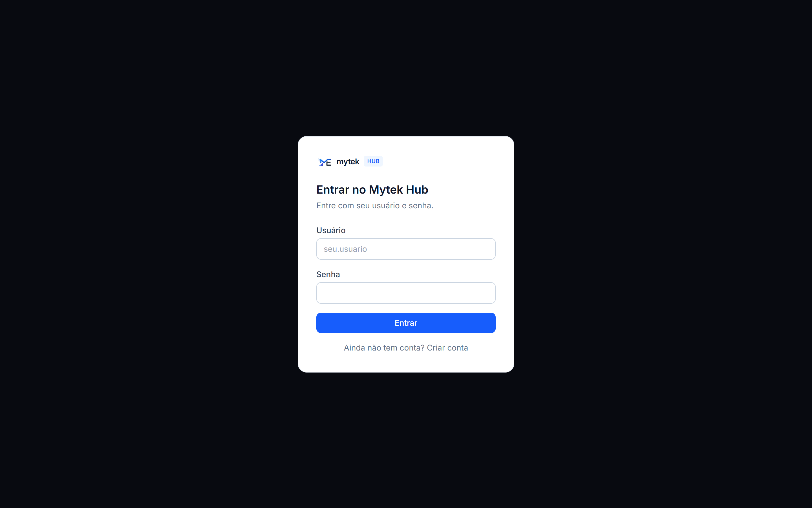

# Mytek Hub



Hub interno de operação para equipes: três módulos no mesmo projeto, com o
mesmo login:

- **Tarefas** (`/board`): quadro A Fazer / Em Andamento / Concluído, com
  sincronização em tempo real entre todo mundo logado ao mesmo tempo.
- **Wiki** (`/wiki`): páginas de texto rico com editor de blocos (tipo
  Notion), usando a biblioteca open-source
  [BlockNote](https://www.blocknotejs.org/) — plugada direto no nosso
  próprio banco em vez de vir com um app inteiro de terceiros junto.
- **Mensagens** (`/chat`): conversas diretas e por canal entre pessoas do
  time, em tempo real.
- **Integração com IA** (`/conta/ia`): cada pessoa gera um token pessoal e
  conecta a própria IA (Claude Desktop, Claude Code etc.) num servidor MCP
  (Model Context Protocol) exposto pelo hub — a partir daí, pedir "cria uma
  tarefa no projeto X" pra IA já cria de verdade, em nome de quem pediu.
  Detalhes na seção [Servidor MCP](#servidor-mcp-model-context-protocol)
  abaixo.

Além disso, o projeto inclui gestão de **Projetos**, **Calendário**,
**Solicitações** e um **portal de acompanhamento para clientes**
(`/progresso/[token]`), com faturas, documentos e linha do tempo.

**Stack:** Next.js (App Router) + Supabase (banco + autenticação) +
Tailwind + BlockNote/Mantine (editor da wiki) + `mcp-handler`/`zod` para o
servidor MCP, pronto pra abrir no Cursor e publicar na Vercel.

## 1. Criar o projeto no Supabase

1. Crie uma conta/projeto em [supabase.com](https://supabase.com) (tem plano gratuito).
2. Em **Project Settings → API**, copie a **Project URL** e a **anon public key**.
3. Em **SQL Editor**, cole e rode, em ordem, os arquivos de
   `supabase/migrations/` — isso cria as tabelas, as permissões de acesso e
   liga o tempo real.
4. (Opcional, recomendado pra protótipo interno) Em **Authentication → Providers → Email**,
   desative "Confirm email" pra não depender de configurar envio de e-mail
   agora. Dá pra reativar depois.

## 2. Rodar localmente

```bash
cd mytek-hub
cp .env.local.example .env.local
# edite .env.local com a URL e a anon key do seu projeto Supabase

npm install
npm run dev
```

Acesse `http://localhost:3000`, crie sua conta (tela de cadastro) e comece
a usar o quadro de tarefas, a wiki e as mensagens (links no menu lateral).
Pra testar o chat de verdade, crie uma segunda conta (outro usuário) numa
aba anônima.

Pra rodar os testes (lógica de resolução das tools do MCP — nome de
projeto/pessoa por texto livre, ambiguidade, regras de visibilidade):

```bash
npm test
```

## 3. Publicar na Vercel

1. Suba esse projeto pra um repositório no GitHub da MyTek.
2. Em [vercel.com](https://vercel.com), importe o repositório.
3. Em **Environment Variables**, adicione as mesmas duas variáveis do
   `.env.local`:
   - `NEXT_PUBLIC_SUPABASE_URL`
   - `NEXT_PUBLIC_SUPABASE_ANON_KEY`
4. Deploy.

## Identidade visual

A UI usa a paleta da marca mytek (azul `#175dfc` no tema claro,
`#3180ff` no escuro) — ver `app/globals.css` e `tailwind.config.ts`. O
ícone da marca está em `public/brand/logo.png`.

## Servidor MCP (Model Context Protocol)

O hub expõe um servidor [MCP](https://modelcontextprotocol.io/) em
`/api/mcp` (`app/api/[transport]/route.ts`, construído com
[`mcp-handler`](https://github.com/vercel/mcp-handler) + validação de
entrada com Zod), pra que qualquer pessoa do time opere o hub direto pela
própria IA (Claude Desktop, Claude Code, ou qualquer cliente MCP),
sem precisar abrir o site.

**Autenticação.** Não existe sessão de login normal (cookie) numa chamada
MCP — quem chama é a IA de alguém, de fora do navegador. Em
`/conta/ia` cada pessoa gera um **token pessoal** (`lib/mcp-tokens.ts`,
`supabase/migrations/0031_personal_ai_tokens.sql`) e configura o cliente MCP
com a URL `https://<seu-dominio>/api/mcp` e esse token no header
`Authorization`. A rota valida o token a cada chamada (`withMcpAuth`) e
aplica, na mão, as mesmas regras de visibilidade que a pessoa já tem no
site (projetos próprios, públicos, ou onde ela tem tarefa) — ver
`lib/mcp-server-helpers.ts`.

**Tools disponíveis:**

| Tool | O que faz |
| --- | --- |
| `now_listar_projetos` | Lista os projetos visíveis pra quem chamou, com filtro por nome. |
| `now_criar_tarefa` | Cria uma tarefa de verdade (projeto, prazo, responsável, status). |
| `now_listar_tarefas` | Lista tarefas com filtros de projeto, status e responsável. |
| `now_atualizar_status_tarefa` | Muda o status de uma tarefa existente pelo título. |
| `now_editar_tarefa` | Edita título, descrição, prazo, responsável e/ou status de uma tarefa. |
| `now_comentar_tarefa` | Adiciona um comentário numa tarefa existente. |

Cada tool resolve nomes ambíguos de forma conversacional (ex: `projeto` e
`responsavel` aceitam nome parcial; se baterem com mais de um resultado, a
tool devolve a lista pra IA perguntar de novo em vez de adivinhar) e
retorna tanto texto quanto `structuredContent`, para uso tanto por um
agente conversacional quanto por um pipeline programático.

## Estrutura do projeto

```
app/
  page.tsx                → redireciona para /login ou /board
  login/page.tsx          → tela de entrar/criar conta
  onboarding/page.tsx     → configuração inicial do workspace
  (app)/board/page.tsx    → quadro de tarefas (protegido por login)
  (app)/calendario/       → calendário da equipe
  (app)/wiki/             → wiki (lista + editor de páginas)
  (app)/chat/             → mensagens diretas e por canal
  (app)/projetos/         → gestão de projetos
  (app)/solicitacoes/     → solicitações internas
  (app)/conta/ia/         → geração de tokens pessoais pra IA (MCP)
  api/[transport]/        → servidor MCP (tools do Now Organiza)
  progresso/[token]/      → portal público de acompanhamento do cliente
components/                → componentes de UI e lógica de cada módulo
lib/                       → clientes Supabase, tipos, utilitários e helpers do MCP
middleware.ts               → protege as rotas (exige login)
supabase/migrations/        → SQL do banco de dados
```
